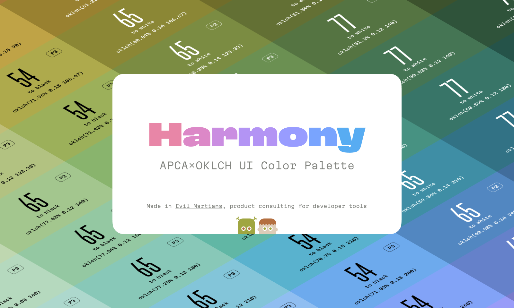

# Harmony: Accessible UI Color Palette

The
[Harmony palette](https://www.figma.com/community/file/1287828769207775946/harmony-accessible-ui-color-palette)
is designed to elevate control over color contrast in your design system. With
the OKLCH color space and the innovative APCA contrast algorithm, Harmony offers
highly consistent color shades, previously unavailable P3 gamut colors, and
precise control over text and UI element contrast.

  Made
by
<b><a href="https://evilmartians.com/devtools?utm_source=harmony&utm_campaign=devtools-button&utm_medium=github">Evil
Martians</a></b>, product consulting for <b>developer tools</b>.

## Features

- Equal contrast within lightness groups
- Mirrored contrast pairs
- Contrast levels for readability
- Tailwind compatibility
- P3 gamut for maximum color

## Installation

```shell
npm install @evilmartians/harmony
```

## Usage with Tailwind

Harmony can work as drop-in replacement for the Tailwind color palette:

```js
// tailwind.config.js

import harmonyPalette from "@evilmartians/harmony/tailwind";

export default {
  theme: {
    colors: harmonyPalette,
  },
  //...
};
```

> ⚠️ Harmony uses `oklch` colors and so requires a polyfill for old browsers

1. Install PostCSS plugin that polyfills oklch colors

```shell
npm install -D @csstools/postcss-oklab-function
```

2. Enable it in `postcss.config.js`:

```diff
export default {
    plugins: {
        tailwindcss: {},
+       '@csstools/postcss-oklab-function': { 'preserve': true },
        autoprefixer: {},
    },
}
```

## Vanilla CSS

Harmony palette provides a set of files with css variables. Each file contains all shades for one color in OKLCH with RGB fallbacks for old browsers. Just import colors you need and use them in css:

```css
@import '@evilmartians/harmony/css/orange.css';

h1 {
  color: var(--orange-600);
}
```

## Other formats

Plain javascript object with colors without tailwind's specifics can be imported
from `@evilmartians/harmony/base`

```js
import palette from "@evilmartians/harmony/base";
console.log(palette.red["50"]); // => oklch(0.988281 0.0046875 20)
```
